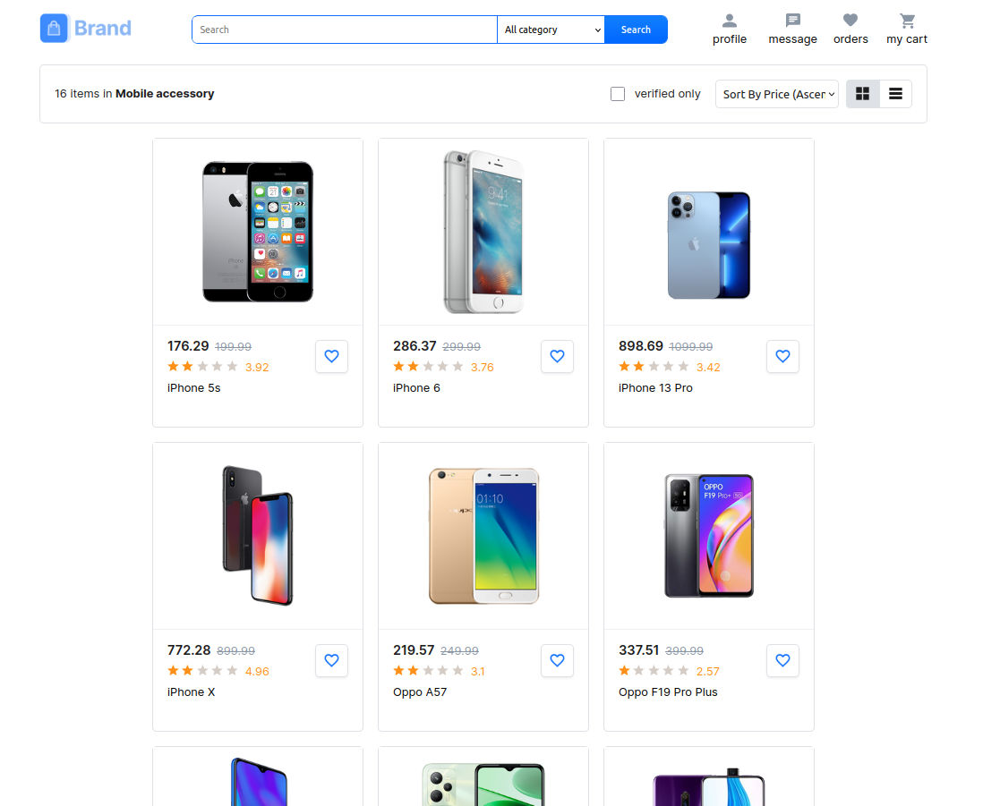
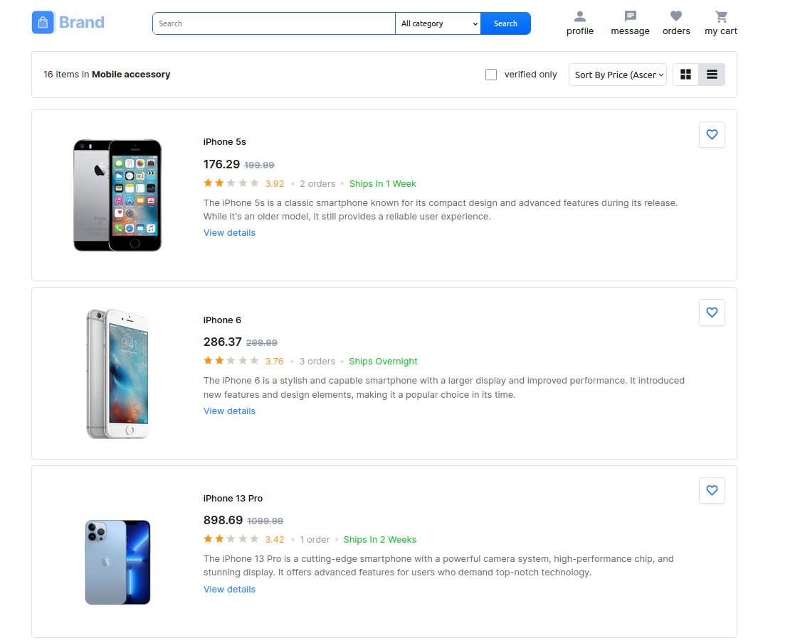

### Ecommerce website

## 🌟 About the Project

This is a simple website built to showcase basic web development skills using HTML, CSS, and JavaScript. The website includes a clean layout, responsive design, and interactive elements.

## ✨ Features

Product List Page: Displays product items on the page.
The display of products can be changed from grid to list.
The products can be searched and sorted.
Products are displayed using pagination on the page.

## 📸 Screenshots

Product List - Grid View

Product List - List View

## 🔧 Technologies Used

HTML5: Markup for structuring the website.
CSS3: Styling and layout design.
JavaScript: Basic interactivity and functionality.
